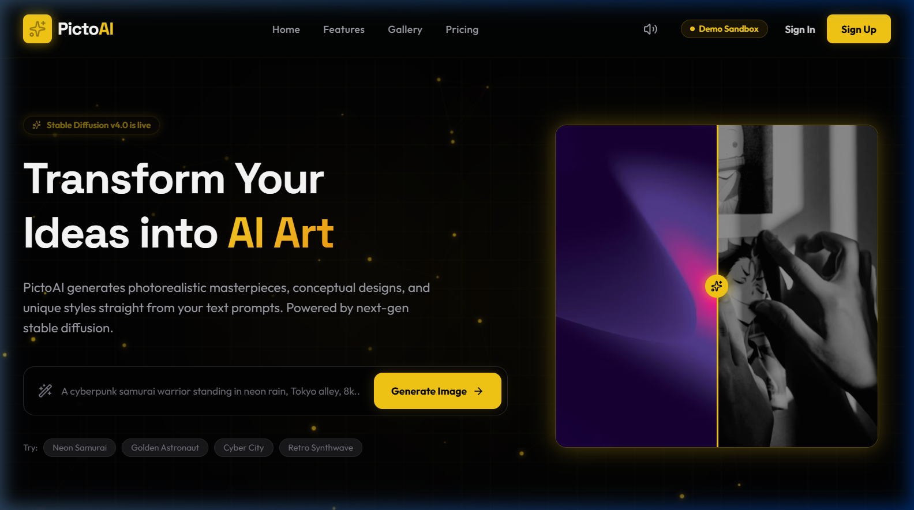
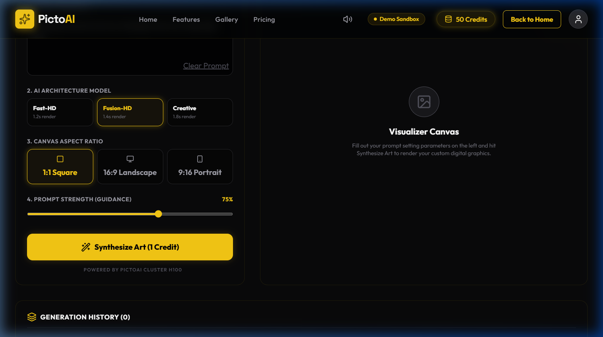
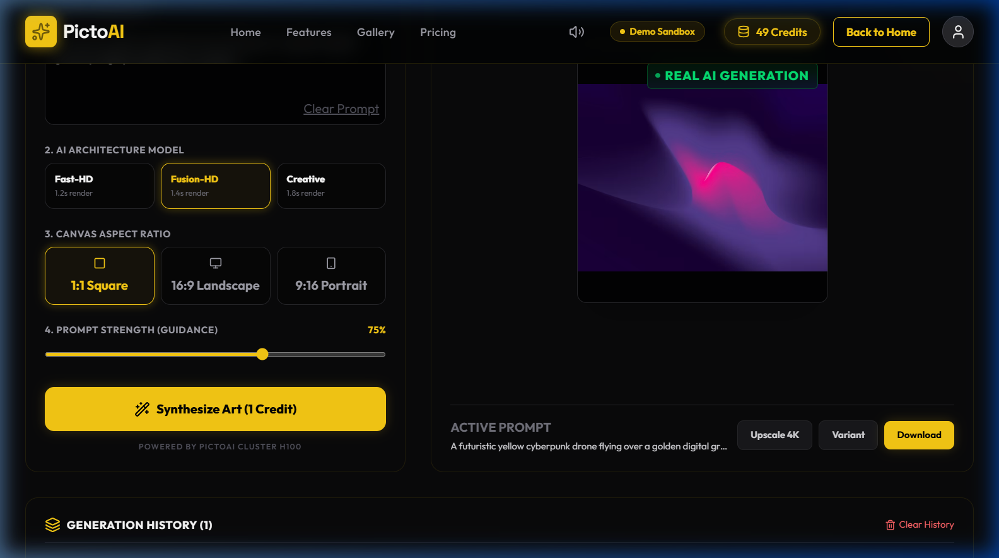

# PictoAI: Market Readiness and Commercial Viability Assessment

**Prepared By:** Piyush Bhardwaj  
**Candidate for Tech & Product Development Internship**  
**Date:** June 2026  

---

## 1. Executive Summary

PictoAI is a full-stack AI-powered text-to-image generation platform built using a React.js frontend, Flask backend, MongoDB database, and Hugging Face Stable Diffusion models. It enables users to generate high-quality images using natural language prompts through a simple web-based interface.

The purpose of this assessment is to evaluate PictoAI's readiness for commercial launch by analyzing its market opportunity, competitive positioning, technical scalability, monetization strategy, and operational gaps that need to be addressed before market entry.

## 2. Problem Statement & Solution

### The Challenges in Visual Content Creation
Modern creators, marketers, and businesses face significant bottlenecks in traditional design workflows:
* **High Designer and Licensing Fees:** Graphic design agencies and premium stock photo libraries impose steep, recurring costs that are prohibitive for small businesses and independent creators.
* **Slow Production Turnarounds:** Traditional visual asset design requires cycles of feedback and revisions, limiting a brand's agility and response time to fast-moving digital trends.
* **Complexity of Professional Design Tools:** Industry-standard editing suites (e.g., Adobe Photoshop) present steep learning curves, requiring hours of specialized training for simple graphic designs.
* **Technical Barriers in Raw Generative AI:** Although open-source AI models are capable, they require technical environment setups, command-line usage, prompt-engineering expertise, and expensive local GPU hardware.

### How PictoAI Addresses These Problems
PictoAI democratizes digital art generation by providing an intuitive, web-based sandbox interface that abstracts away technical complexities:
* **User-Friendly Web Interface:** A clean, accessible GUI replaces complex setups and prompt inputs.
* **No Prompt Engineering Required:** Predefined artistic presets guide the generation process.
* **Style Presets:** Features curated styles like Cyberpunk, Anime, and Oil Painting.
* **Multiple Aspect Ratios:** Allows instant optimization for multiple channels (1:1, 16:9, 9:16).
* **Fast AI-Powered Image Generation:** High-fidelity generation completes in seconds.

## 3. Product Overview

PictoAI offers an interactive prompt workspace integrating frontend design with machine learning models:
* **Core Text-to-Image Engine:** Generates styled digital art based on user prompt inputs.
* **Multiple Generation Modes:** Supports Standard (SD 1.5), HD (SDXL), and Creative (DreamShaper) models.
* **Credit-Based Generation System:** Deducts credits per prompt run to restrict compute abuse.
* **JWT Authentication & User Management:** Restricts API access to authorized sessions.
* **Intelligent MongoDB Caching:** Computes MD5 request hashes of prompt parameters to serve duplicate generation requests instantly, reducing repeated inference costs.
* **Multi-Tier Fallback Architecture:** 
  1. *Local GPU Inference:* Runs local diffusers pipelines if CUDA hardware is available.
  2. *Hugging Face API Fallback:* Routes queries to serverless endpoints if local resources are busy.
  3. *Public API Fallback:* Leverages keyless routing (e.g., Pollinations AI) under high load.
  4. *Offline Placeholder Generation:* Generates an offline PIL image if all networks fail.

PictoAI possesses a fully functional MVP with end-to-end generation capability.

<table style="width: 100%; border: none; margin-top: 10px; margin-bottom: 0px;">
  <tr>
    <td style="border: none; padding: 2px; text-align: center; width: 33%;">
      
      <div style="font-size: 7pt; color: #64748b; margin-top: 2px;">Landing Page &amp; Slider</div>
    </td>
    <td style="border: none; padding: 2px; text-align: center; width: 33%;">
      
      <div style="font-size: 7pt; color: #64748b; margin-top: 2px;">Workspace Sandbox</div>
    </td>
    <td style="border: none; padding: 2px; text-align: center; width: 33%;">
      
      <div style="font-size: 7pt; color: #64748b; margin-top: 2px;">Active Image Generation</div>
    </td>
  </tr>
</table>
<div style="font-size: 8pt; text-align: center; color: #64748b; margin-top: 3px; font-style: italic;">
  Figure 1: PictoAI User Interface and Image Generation Workflow
</div>

---

## 4. Market Opportunity Analysis

The global Generative AI and AI design tools market is expanding rapidly, driven by the digital-first content economy. PictoAI is positioned to target six high-growth customer segments:
* **Content Creators:** YouTubers and bloggers requiring rapid, high-quality thumbnails and illustrations.
* **Social Media Managers:** Specialists who need visual assets to test social media campaigns.
* **Marketing Teams:** Teams generating visual mockups, ad creatives, and presentation graphics.
* **Small Businesses:** Local shop owners who need basic marketing materials but lack budget for professional design agencies.
* **Students and Educators:** Academics who need clear diagrams, slide backgrounds, and digital portfolios.
* **E-commerce Sellers:** Retailers looking to generate lifestyle backdrops and visual scenes around raw product shots.

Small businesses and independent creators were selected as the primary target market because they have high demand for visual content but often lack dedicated design resources and budget for premium creative tools.

## 5. Product-Market Fit Assessment

PictoAI addresses a growing demand for accessible AI-powered content creation tools among creators and small businesses that lack professional design resources. The platform's ease of use, predefined creative presets, and freemium potential position it strongly within the mid-market segment. Early validation should focus on user retention, generation frequency, and conversion from free to paid plans. Future validation should involve pilot testing with early adopters to gather qualitative feedback, measure engagement metrics, and refine feature prioritization based on user behavior.

To validate product-market fit after launch, the following target KPIs have been established:

| Metric | Target | Description / Justification |
| :--- | :--- | :--- |
| **Monthly Active Users (MAU)** | 10,000+ | Initial scale target to build brand presence and support standard subscription metrics. |
| **Free to Paid Conversion** | 5–8% | Target conversion rate of free starter users upgrading to paid monthly tiers. |
| **Average Generations per User** | 20 / month | Indicator of active tool utilization, value delivery, and prompt engagement. |
| **30-Day User Retention** | > 40% | Target percentage of users returning to generate images 30 days after registration. |
| **Average Response Time** | < 10 seconds | Technical SLA for end-to-end prompt inference, caching, and image delivery. |

---

## 6. Competitive Analysis

To establish a clear market position, PictoAI must be compared against dominant industry players:

| Feature | DALL·E 3 | Midjourney | Adobe Firefly | Canva AI | PictoAI |
| :--- | :--- | :--- | :--- | :--- | :--- |
| **Ease of Use** | Very High | Medium | High | Very High | **High** |
| **Pricing Accessibility**| Low | Medium | Medium | High | **Medium** |
| **Customization** | Low | High | Medium | Low | **Medium** |
| **Target Audience** | General Consumers| Professional Artists| Enterprise Teams | Small Businesses| **Content Creators & SMBs** |
| **Integration** | High | None | Enterprise API | Limited | **High** |

> **Positioning Statement:**  
> PictoAI is not designed to replace industry leaders such as Midjourney or DALL·E 3. Instead, it addresses a market gap by providing an affordable, user-friendly, and scalable AI image generation platform tailored for content creators and small businesses.

### PictoAI's Key Differentiators:
* **Beginner-Friendly Experience:** Simple UI slider features and presets abstract away prompt engineering.
* **Web-Based Interface:** No Discord or complex CLI configurations required.
* **Flexible Pricing:** Freemium credits and pay-as-you-go credit packs fit mid-tier creator budgets.
* **Multi-Tier Fallback Architecture:** High platform uptime compared to single-endpoint web applications.
* **Focus on Small Businesses & Creators:** Features aspect ratios and style presets tailored to commercial content needs.

## 7. Market Readiness Assessment

### SWOT Analysis
* **Strengths:** Functional MVP completed; Multi-tier fallback architecture; Intelligent caching strategy; Modern user experience.
* **Weaknesses:** Limited user validation; Missing production-grade payment integration; No advanced content moderation system; Some advanced features remain under development (Upscale, Variation endpoints are currently mocked).
* **Opportunities:** Rapid growth of generative AI; API monetization opportunities; Expansion into enterprise use cases.
* **Threats:** Strong market competition; High GPU infrastructure costs; Copyright and regulatory concerns.

### Overall Market Readiness Score: **7.5 / 10**

> **Justification:**  
> PictoAI demonstrates strong technical execution, a clearly defined target audience, and a sustainable monetization approach. While enhancements in content moderation, payment infrastructure, and advanced feature completeness are required, these improvements are operational rather than fundamental, supporting its readiness for phased market entry.

---

## 8. Monetization Strategy

PictoAI will deploy a hybrid monetization framework to offset computational overhead and ensure profitability:
* **Freemium Plan:** Limited monthly credits, standard speed, watermark applied, standard models.
* **Professional Subscription Tier:** Higher generation limits, HD/Creative models, no watermark, commercial use license.
* **Enterprise Subscription Tier:** Priority processing, higher limits, commercial licensing, 4K upscaling, dedicated API gateway, full IP ownership.
* **Additional Credit Packs:** Pay-as-you-go generation credits for users who exhaust their monthly allowances.
* **API Licensing:** Usage-based pricing for third-party integrations.

This approach balances affordability for creators with sustainable infrastructure costs.

## 9. Recommendations Before Market Launch

To successfully transition PictoAI from its current state to a market-ready product, the development team should execute the following recommendations in a phased launch roadmap:

```
🚀 PHASED LAUNCH ROADMAP
├─ Phase 1: Security & Compliance (Weeks 1-2)
│  └─ Implement NSFW filters & moderation API (OpenAI or lightweight Hugging Face classifier).
├─ Phase 2: Feature Completeness (Weeks 3-4)
│  └─ Replace mock endpoints in Flask controller with active Real-ESRGAN upscaler & img2img variation.
├─ Phase 3: Monetization Integration (Weeks 5-6)
│  └─ Replace simulated checkout with live Stripe Billing and webhook payment listener.
├─ Phase 4: Scalability & Operations (Weeks 7-8)
│  └─ Migrate local Flask server inference to serverless GPU infrastructure (RunPod or Replicate).
└─ Phase 5: Testing & Go-To-Market (Weeks 9-10)
   └─ Integrate Sentry telemetry logging and launch private beta testing with 100+ active creators.
```

## 10. Limitations

This assessment is based on the current MVP implementation of PictoAI and secondary market observations. Future strategic decisions should be validated through pilot testing and user feedback.

## 11. Conclusion

Based on the current implementation and market analysis, I believe PictoAI has strong potential to become a commercially viable product. Its focus on accessibility, creator-centric workflows, and affordable AI-powered content generation positions it well within the growing creator economy. With improvements in scalability, payment integration, and content moderation, PictoAI can establish a differentiated position in the AI-powered content creation market.
